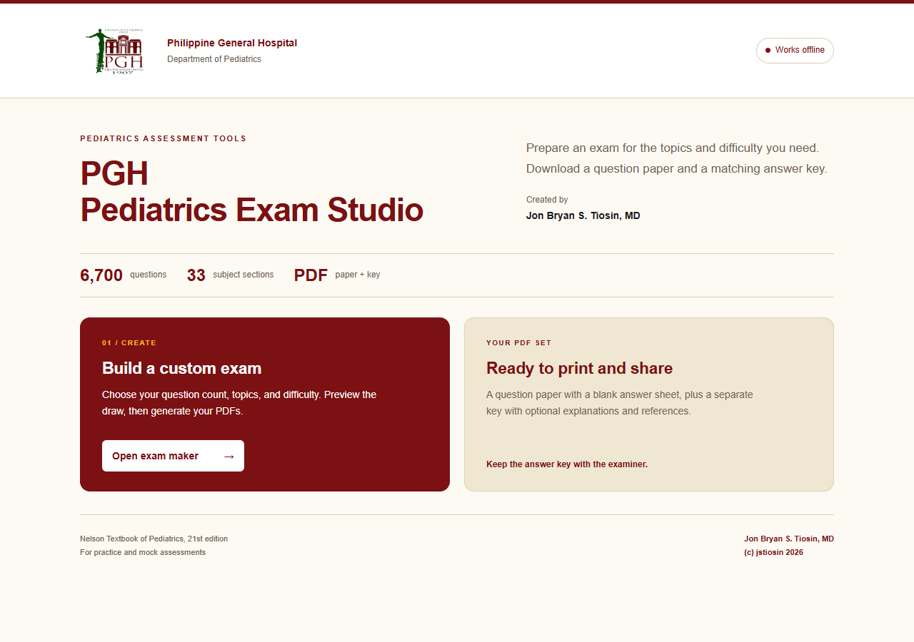

# PGH Pediatrics Exam Studio

**Philippine General Hospital | v2.0 | October 7, 2026**

Created by **Jon Bryan S. Tiosin, MD**. **(c) jstiosin 2026** appears on every HTML page and every generated PDF page, including blank answer sheets and compact keys.

An offline, mobile-friendly workspace for assembling pediatric practice exams from the existing 6,700-question Nelson Textbook of Pediatrics, 21st-edition bank. This edition provides the exam maker without a standalone question-bank page.

## Open the studio

Download the [complete offline package](20261007_PGH_PediatricsExamStudio_v2.0.zip), extract it, and open **[index.html](index.html)** in a browser that supports local HTML apps. Keep the extracted files together for navigation. GitHub's HTML source view does not run the application.

- [index.html](index.html): the hospital-branded landing page.
- [exam-maker.html](exam-maker.html): question count, topics, difficulty, and matching PDF exports.
- [Sample exam with blank answer sheet](samples/exam.pdf): 12 pages.
- [Sample answer key with explanations](samples/answer-key.pdf): 28 pages.

Each application HTML embeds its own questions, scripts, styles, logo, PDF libraries, and fonts. No account, installation, server, or internet connection is needed to generate exams. A file previewer that does not execute JavaScript cannot operate the applications.

## Generate an exam

1. Open **Exam maker** from the landing page. Enter the exam title, date, duration, and number of questions.
2. Select sections or specific topics. The question count must allow at least one question per selected group.
3. Choose Easy, Average, Difficult, Mixed, or a custom difficulty mix. Traditional single-best-answer questions are selected by default. The optional legacy Type K setting retains the 40% cap.
4. Choose whether to include rationales and references in the key, then select **Generate exam**. Review the draw five questions at a time.
5. On desktop, download the question paper and answer key. On mobile, tap **Prepare exam PDF** or **Prepare answer key PDF**, then tap its **Save or open** link. If a preview opens, use the browser's Save or Share control.

The paper and key use the same questions, order, and exam code. The paper includes a blank answer sheet. Changing settings clears the old draw and PDF links. Download the PDFs and optional JSON exam record before closing the tab; the current draw is not automatically saved. Record import is not implemented. Repeatable draws use the same seed and settings.

On phones, **Setup**, **Topics**, and **Your exam** shortcuts reduce scrolling. The bottom action button changes from generating the exam to viewing PDFs and hides while entering text or numbers. Layouts, navigation, and touch targets adapt to narrow screens.

The HTML applications contain the complete question pool and answers. Keep the exam maker and answer key with examiners, and distribute the question-paper PDF to examinees. Standalone HTML cannot conceal embedded answer data.

## Content and design

The unchanged bank contains 6,700 questions across 33 sections and 579 distinct topic labels. Traditional single-best-answer questions account for 5,190 items. Section 18 retains the corrected September 29, 2026 Respiratory System content. Section 34, Laboratory Medicine, is not included. Legacy identifiers, answer letters, rationales, and references are preserved.

This release changes presentation, navigation, and attribution. It does not perform a fresh clinical source review. Difficulty labels are editorial estimates, not measured item difficulty. Use the existing bank for practice and mock assessments.

The established PGH Heritage palette uses maroon, forest green, cream, and gold. The original PGH logo was retrieved from the [official PGH website](https://www.pgh.gov.ph/about-pgh/) on October 6, 2026 and is embedded without redrawing or recoloring. These are established workspace palettes, not a claim of published official hospital brand manuals. PDFs use A4 pages and embedded Calibri fonts.

## Screenshots



[View the mobile landing page](screenshots/landing-mobile.png).

## Verification

Verified on October 7, 2026: **754 checks passed**.

- **30 landing checks**: branding, embedded logo, credit, responsive layout, navigation, and edition-specific question-bank availability.
- **60 mobile exam-maker checks**: widths of 320, 360, 390, 430, 768, and 932 px, touch controls, topic search, validation, preview pagination, and PDF save links.
- **32 browser regression checks**: offline generation, direct PDF downloads, topic and difficulty allocation, repeatable draws, invalid settings, and stale-download prevention.
- **632 PDF checks**: content and answer parity, references, A4 size, margins, fonts, page numbers, institutional headers, full author name, and exact copyright credit on every page.

All 41 pages of the sample paper, detailed key, and compact test key were rendered and visually inspected. Desktop and mobile landing screenshots were inspected. Additional mobile-download PDFs were checked for the full name and credit on every page. The sample uses 50 questions, seed `20261006`, and exam code `143YVH2`.

Testing used Chrome desktop and touch emulation with the network disabled. Physical phones and Safari were not tested. Large draws can take more time and memory on mobile devices. These checks validate software behavior and source-data preservation, not clinical correctness.

With Node.js, Playwright, and its Chromium browser installed, run from this repository:

```sh
node tests/landing.cjs
node tests/mobile.cjs
node tests/regression.cjs
```

Optionally set `BROWSER_PATH` to an installed Chrome/Edge executable and `PLAYWRIGHT_MODULE` to an existing Playwright package. After the regression suite generates PDFs, run the PDF checks with Python, PyMuPDF, and Pillow:

```sh
python tests/inspect_pdfs.py
```

Test outputs go under ignored `.tmp/`; landing screenshots also refresh `screenshots/`. Test tooling is not needed to use the studio.

PDF generation embeds [pdf-lib](https://pdf-lib.js.org/) and [fontkit](https://github.com/Hopding/fontkit), with their attribution retained in the HTML. This repository grants no additional rights to third-party references, fonts, software, or institutional marks.
